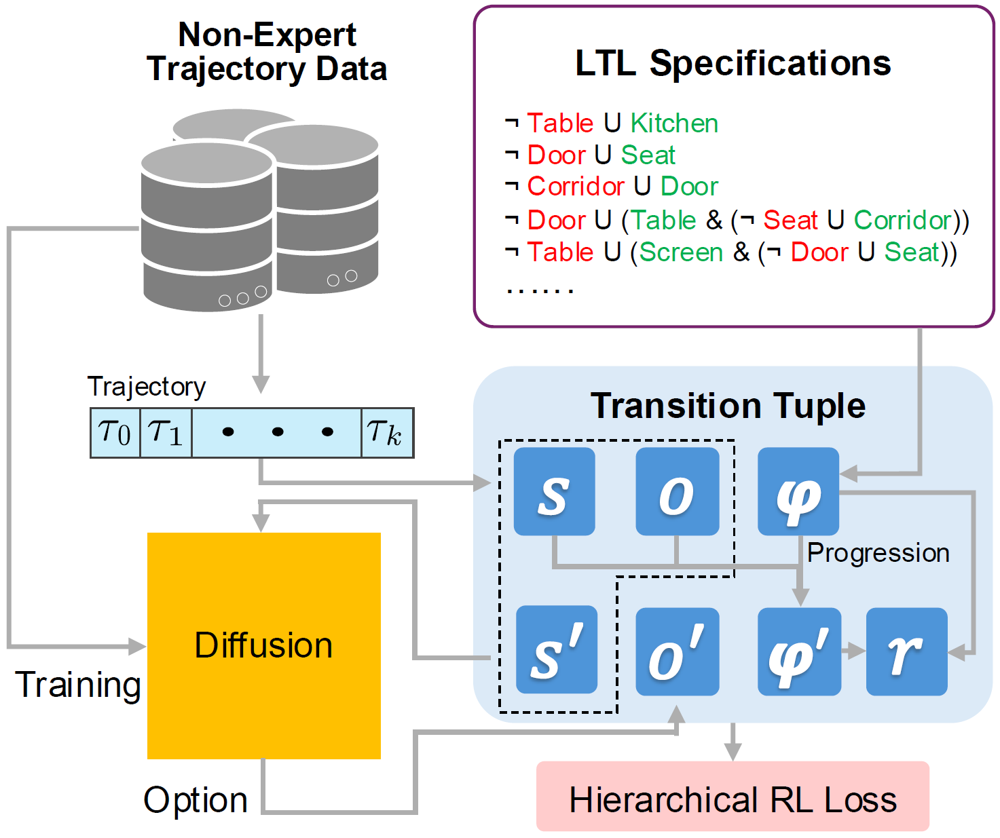

# Diffusion Meets Options: Hierarchical Generative Skill Composition for Temporally-Extended Tasks
[](https://arxiv.org/abs/2410.02389)
[](https://opensource.org/licenses/MIT)
[[Project page]](https://philiptheother.github.io/doppler/)

[Zeyu Feng](https://scholar.google.com/citations?user=l-Ob1vAAAAAJ&hl=en)<sup>1</sup>,
[Hao Luan](https://edmundluan.github.io)<sup>1</sup>,
[Kevin Yuchen Ma](https://kevinskwk.github.io/)<sup>1</sup>,
[Harold Soh](https://haroldsoh.com/)<sup>1,2</sup>

<sup>1</sup>Department of Computer Science, School
of Computing, National University of Singapore,
<sup>2</sup>Smart Systems Institute, National University of Singapore

<p align="center">
  
</p>

This repository contains the implementation of the offline hierarchical planning method under LTL constraints proposed in the ICRA 2025 paper [Diffusion Meets Options: Hierarchical Generative Skill Composition for Temporally-Extended Tasks](https://arxiv.org/abs/2410.02389).

If you find this repo or the ideas presented in our paper useful for your research, please consider citing our paper.
```
@INPROCEEDINGS{feng2025doppler,
    author    = {Feng, Zeyu and Luan, Hao and Ma, Kevin Yuchen and Soh, Harold},
    booktitle = {2025 IEEE International Conference on Robotics and Automation (ICRA)}, 
    title     = {Diffusion Meets Options: Hierarchical Generative Skill Composition for Temporally-Extended Tasks},
    year      = {2025},
    volume    = {},
    number    = {},
    pages     = {},
    keywords  = {},
    doi       = {},
}
```


## 📢 Introduction
Safe and successful deployment of robots requires not only the ability to generate complex plans but also the capacity to frequently replan and correct execution errors. This paper addresses the challenge of long-horizon trajectory planning under temporally extended objectives in a receding horizon manner. To this end, we propose DOPPLER, a data-driven hierarchical framework that generates and updates plans based on instruction specified by linear temporal logic (LTL). Our method decomposes temporal tasks into chain of options with hierarchical reinforcement learning from offline non-expert datasets. It leverages diffusion models to generate options with low-level actions. We devise a determinantal-guided posterior sampling technique during batch generation, which improves the speed and diversity of diffusion generated options, leading to more efficient querying. Experiments on robot navigation and manipulation tasks demonstrate that DOPPLER can generate sequences of trajectories that progressively satisfy the specified formulae for obstacle avoidance and sequential visitation.


## 🔨 Usage
Code will be released soon.
<!-- For training and testing on `Maze2d` and `PushT` tasks, please see specific instructions in the folders [Maze2d](./maze2d) and [PushT](./pusht), respectively. -->

<!-- In order to download our augmented dataset of trajectories in `PushT` task, go to: [PushT_GoogleDrive](https://drive.google.com/file/d/1jRfJtiBL-cYcFbmQczzVGXK8THSp--en/view?usp=sharing). -->


## 🏷️ License
This repository is released under the MIT license. See [LICENSE](LICENSE) for additional details.


## 🙏 Acknowledgement
* Our Maze2d and PushT implementations are based on [Diffuser](https://github.com/jannerm/diffuser), [Diffusion Policy](https://github.com/real-stanford/diffusion_policy) and [LTLDoG](https://github.com/clear-nus/ltldog).
